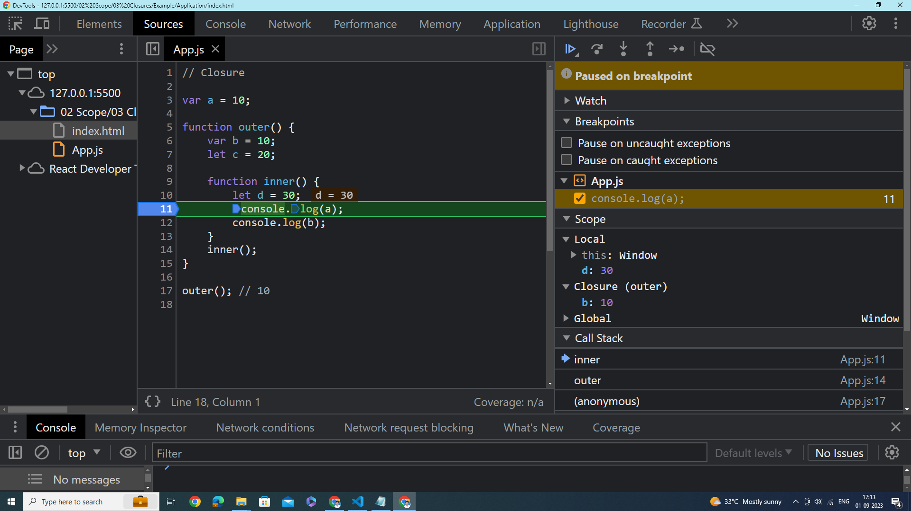
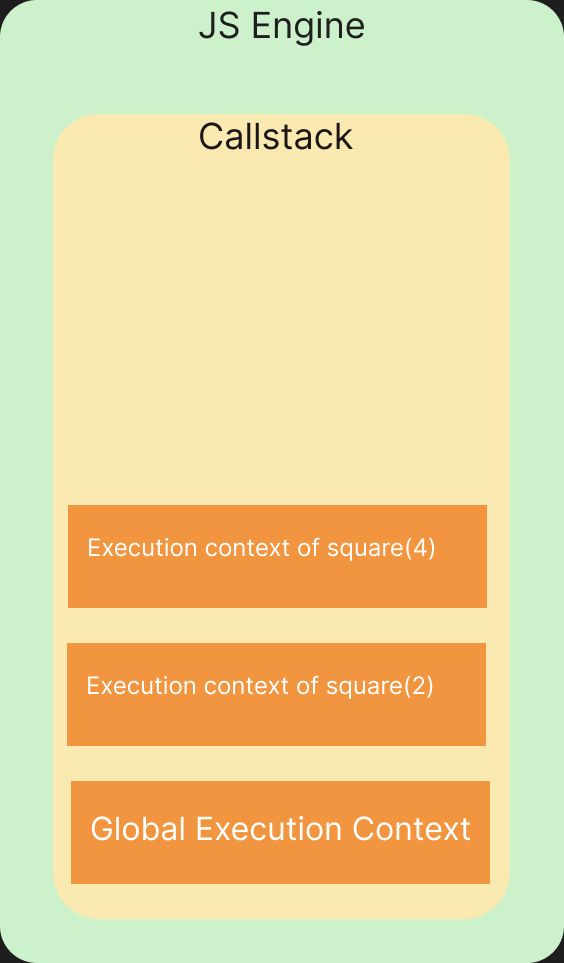
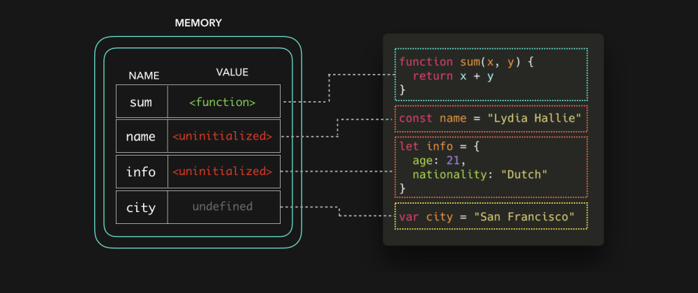
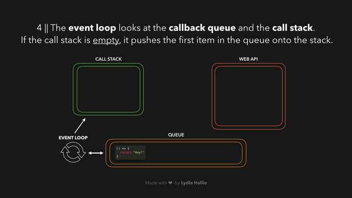
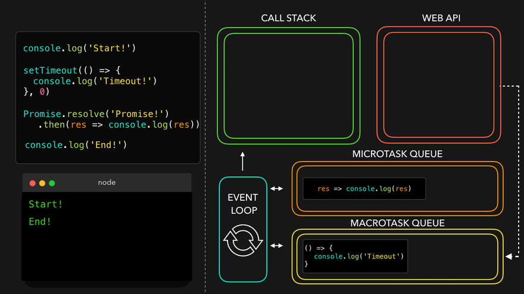
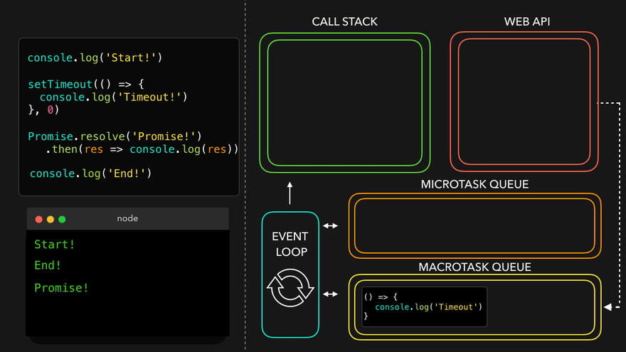

# Javascript

---

<details>
<summary>Index</summary>

### Index

- Introduction
- variables  
- Scope
- JS Environment
- this Keyword
- Operators
- Functions
- Data Structures
- Asynchronous
- Datatypes
- String Methods
- Array Methods
- Object
- Set
- Map
- Built-in Methods
- DOM
- Storage
- Class
- JSON
- Promise
- Object Methods
- Control Statements
- Template Literals
- Code Working

</details>

---

<details>
<summary>Introduction</summary>

### Introduction

##### What is **Javascript**?  
__JavaScript__ is a scripting language for web pages.  
we can also use Javascript on server-side as __Node JS__.

we can create Dynamic Webpages by combining HTML and Javascript.

##### Javascript Advantages
  - Server interaction is less.
  - Immediate response to the users.

##### **Dynamically Typed** language?
Yes, JavaScript is a dynamically typed language.

* We can declare a variable without specifying the data type.
* Javascript itself check and identify type of variable based on given value.
* We can change the data type of the variable when it is re-assigned.

* Strictly Typed language : Java, Typescript

#####  Display Javascript Output

  ```js
// console
console.log("Hello World");

// textContent
let myElement = document.getElementById("myElement");
myElement.textContent = "Hello World";

// innerHTML
let myElement = document.getElementById("myElement");
myElement.innerHTML = "<h1>Hello World</h1>";

// write
document.write("Hello World");

// alert
window.alert("Hello World"); // only popup

//prompt
window.promt("Hello World");  // popup with  input textbox 
  ```

##### What is an ECMA Script?
__ECMA Script__ stands for __European Computer Manufacturers Association Script__.
ECMA Script maintains the rules of a scripting language.  
It specifies the core features that a scripting language should provide and how those features should be implemented.

##### Javascript version
I know ES6 version

</details>

---

<details>
<summary>Variables</summary>

### Variable
Variables are like containers. we can use these containers to store data during program execution.   
we can mention a name for identify a particular container. So those named Containers are called variables.     
we can manipulate the data in the containers by referring that variable name.  
we can store different types of data in the containers. In programming languages, we have some categories in data.

Javascript supports various data types: 
1. number 
2. string
3. boolean
4. null
5. undefined

we can assign a value to the variable with the help of assignment Operator( `=`  symbol).

##### Define a Variable
we can create variables using __Variable Declaration__ keywords .
In Javascript we can define a variable in 3 ways,

##### Declaration Keywords
1. var
2. let
3. const

##### Rules of Define a Variable

##### syntax
`Definition = Initialization`  
`declarationKeyword variableName = value;`

#### var
If a variable declare using `var`, then initialization is not mandatory. This variable can be re-assigned and re-declared.  
If a variable is declared inside a function, it is function-scoped. Else, it is global-scoped.

#### let 
If a variable is declared using `let`, then initialization is not mandatory. This variable can be re-assigned.  
we can't re-declare the same variable.

#### const 
If a variable is declared using `const`, then initialization is mandatory. Once the variable is initialized with a value, then it can't be re-assigned.  
const variable maintain constant values.

##### Differences between __var__, __let__ and __const__

| **Declaration Keyword** | **Possible**                                   | **Not-Possible**              |
|-------------------------|------------------------------------------------|-------------------------------|
| **__var__**             | Initialization , Re-Assignment, Re-Declaration |                               |
| **__let__**             | Initialization , Re-Assignment                 | Re-Declaration                |
| **__const__**           | Initialization                                 | Re-Assignment, Re-Declaration |

##### Types of Variables
1. Local Variable
2. Global Variable

##### Local Variable
If a variable is created inside function, that type of variable is called Local Variable.  

* __Example__ :  
If a variable is declared inside a function, When a function is called, its local variables are created, and when the function finishes it's executing, automatically those local variables are destroyed.  

Local variables are useful for temporary data storage within a Block, and they should not interfere with other parts of the program. The Local Variable memory is created in the Local Scope.  
we can access these Local Variables only within that particular block of code.

##### Global Variable
If a variable is created outside a block, then it is called Global variable.

These Global Variables are available completely end of the program execution.
These Global Variables can be accessed at any part of the code including Functions also.  

If the value of the global variable is modified inside a function or conditional statement then the changes are reflected in the rest of the program.  
The Global Variable memory is created in the global scope.

##### Temporal Dead Zone
A block's __Temporal Dead Zone__ starts at the beginning of the block's local scope. It ends when the computer fully initializes your variable with a value.  
we can say in other words, A block's __Temporal Dead Zone__ starts From Hoisting to assigns some value to the variable is called temporal dead zone.  

we can't access the variables, when Variable in __TDZ__

```js 
{
  // myVar TDZ starts here (at the beginning of this block's local scope)
  // myVar TDZ continues here
  // myVar TDZ continues here
  
  console.log(myVar); // returns ReferenceError // because myVar continues here
  
  // myVar TDZ continues here
  // myVar TDZ continues here
  
  let myVar = "Vegetable Fried Rice"; // TDZ ends here
  
  // myVar TDZ does not exist here
  // myVar TDZ does not exist here
}
```

#### Errors
Errors are 2 types:
1. syntax Error
2. Runtime Error

##### SyntaxError
 * If we are not following rules of language, then we got syntax error.
 * Initialization : Missing initializer in const declaration because it is a constant type already mentioned and declared.  
 * Re-Declaration : Identifier 'a' has already been declared.

##### Runtime Error
*  __ReferenceError__
   - When Javascript Engine tries to find a specific variable inside the memory space but that variable does not exist in the memory space.
   - TDZ : Cannot access 'a' before initialization .   
   - Not-Declared : 'c' is not defined.  
   - If a variable in the __TDZ__, we cannot access that particular variable.

* __TypeError__ 
   * Assignment to constant variable.  
   * Mathematical Operations : A Type error can be thrown when we try to make an operation on the incorrect data type.
  
</details>

---

<details>
<summary>Scope</summary>

### Scope
Memory storage location is called scope.  

we have 3 scopes in Javascript  
1. Global Scope (Global + Script)
2. Block Scope
3. Local Scope (Function Scope)

In Global Level with declaration keywords **let** and **const** maintains separate memory with __script__ scope.  

##### what is Block ?
Block is used to combine multiple Javascript statements into one group.  

`Block is { }`

Block memory will be deleted after Execution completed.  
Each Block has its own Lexical scope.

```js
// single statement, so we dont't use block.
if (true) console.log("Hello world");

// Here we are using multiple statements, so we use block.
if (true){
    var a = 10;
    console.log(a);
}
```

##### Closure
A **Closure** is a combination of a __function__ and its __lexical scope__ bundle together forms a Closure.  
A closure gives the outer function's scope access to an inner function that means it can be used the variables and functions of its parent environment.

`Closure => local Memory + Lexical Environment of Parent`



##### Lexical Environment
It is a Parent Memory

##### Uses of Closures
* Timer Functions
* Events
* ...etc

##### Disadvantages of Closures
  * Overconsumption of memory
  * Memory Leak
  * Freeze browser

##### Garbage Collector
Garbage collector is like a program in the browser of the javascript engine.  
In JavaScript, the garbage collector automatically __identifies__ and __removes__ unreferenced objects, freeing up memory to improve performance and prevent memory leaks in the application.

</details>

---

<details>
<summary>JS Environment</summary>

### Javascript Environment

##### Components
 1. Code
 2. JS Runtime Environment
 3. JS Engine
 4. Web APIs
 5. Microtask Queue
 6. Callback Queue
 7. Event Loop 

#### Code


#### JS Runtime Environment


#### JS Engine


#### Web APIs


##### Execution Context


In Javascript, Everything happens inside an __Execution context__ .    
The Execution context is like a big container.  
Inside the Execution Context entire JavaScript code is executed. 
Execution Context contains two components.

`Execution Context => Memory Component + code Component`

`Execution Context => Creation Phase + Execution Phase`

##### Phases of Execution Context
1. Memory phase
2. Code Phase

##### __Memory Component__ (Variable Environment) 
In Memory Component all the variables and functions are stored as key-value pairs.  
When the JavaScript engine allocates memory to a variable, it stores a special value `undefined` in it. 
In the case of functions, it stores the entire function inside the memory space.  
`pair = key : value`

##### __Code Component__ (Thread of Execution)

Code component is the place where code is executed one line at a time. It is also called the **Thread of Execution**.

In this phase, variables in memory component will be initialized.

JavScript is a **synchronous**, **single-threaded** language, which means that it can only execute one line of code at a time in a specific order. It can only move to the next line when the execution of the current line is completed.

__single-threaded__ -> javascript only execute single line (one command) at a time.

__synchronous__ -> Javascript execute next line when once current line execution is finished.

##### Callstack
Before execute the Javascript code, the __Global Execution context__ will be created.  

The execution context is created in two phases : 
  * Memory creation phase - JS will allocate memory to variables and functions.
  * Code execution phase

callstack plays an important role in managing the execution of a program.

callstack handles, automatically create & delete operations of Execution Context.

When a function is invoked, a new execution context is added to the top of the call stack. Once the function execution is completed (returned some value), its execution context is removed from the top of the call stack.

##### Hoisting
Hoisting is a javascript mechanism where __function declarations__ and __var__ keyword variables are moved to the top of their scope before code execution.

Hoisting is a JavaScript technique.

In Global Level, Before Execution of the JS code, It creates a Global Execution Context.

`var` keyword variables and `function` declarations are stored in Global Execution Context.

var keyword variable takes __undefined__ as a default value.

If it is a Function Declaration, It will be stored entire function.

</details>

---

<details>
<summary>this Keyword</summary>

### __this__ keyword

##### Global space:
Any code write in javascript which is not inside a function (Block) is called global space.

### window:
__window__ object is created by javascript engine.
In window object we have many default variables, methods and functions.
window object is a global object because it is created in the global space.
at the global level __this__ object  window object is equal to  window object.

`window === this`

##### this
In JavaScript, __this__ keyword always refers to an object.

* Function Declaration creates its own Execution Context So Function Declaration creates its own `this` object.  
 
  `Function Declaration : Where the function called.`

* Arrow Functions can't create its own Execution context, but it takes __this object__ from Lexical Environment. So Arrow Function, They inherit  __this__ object from their surrounding context.  
 
  `Arrow Function : Where the Function Declared.`

In the global scope, `this` refers to the global object. 

`window === this`  

```js 
console.log(this)

const obj = {
    myVar:10,
    myFn:function(){
        console.log(this)
    },
    myArr:()=>{
        console.log(this)
    }
}

obj.myFn()

obj.myArr()

```

```js 
// this

// this refers to the Object on which we call our function.

// This function declaration is stored in window object.
function displayName(){
    console.log(this.name, this);
}

const myObject = {
    name:"Ande Praveen",
    displayName:displayName
};

var name = "Brendan Eich";

myObject.displayName();  // Ande Praveen
window.displayName();  // Brendan Eich
```


```js 
// Regular Function
const myObject = {
    myMethod: function() {
        console.log(this); // Refers to 'myObject' when called as myObject.myMethod()
    }
};

myObject.myMethod(); // Outputs 'myObject'

```

```js 
// Arrow Function
const myObject = {
    myMethod: () => {
        console.log(this); // Refers to the global 'this' (e.g., 'window' in a browser context)
    }
};

myObject.myMethod();  // Outputs the global 'this', which is typically 'window'

```

##### this methods

we can change __this__ object with below methods.
* call
* apply 
* bind

```js 
// Define the first person object
const person1 = {
    name: 'Praveen',
    surname: 'Ande',
    
    // Define a method to concatenate the name and surname
    sayName: function() {
        return this.name + " " + this.surname;
    }
}

// Define the second person object
const person2 = {
    name: 'Brenden',
    surname: 'Eich'
}

// Call the sayName method of person1 with the context of person2 using .call()

const fullName = person1.sayName.call(person2);  

// Output the result, which will be "Brenden Eich"
console.log(fullName); // Brenden Eich

```

```js
 "use strict"

// 01 this in global space
console.log(this)  // global object in browser is window

console.log("----------------------------------")

// 02 this inside a function

function x(){
    // this inside non-strict mode - (this substitution)
    // The value depends on strict / non strict mode
    console.log(this)  // window object 
    // with strict-mode this is undefined
 
}
x();

/*
If the value of this keyword is undefined or null, then "this" will be replaced with global object.
*/

console.log("----------------------------------")

// 03 this keyword value depends on how the function is called.

x();  // undefined - with strict-mode
window.x(); // window - with strict-mode 

// 04 this inside a object's method
// when a function is written as a value of key in object, then that is called method.

const obj = {
    a:10,
    x:function(){
        console.log(this)
    }
}

obj.x()  // {a: 10, x: ƒ}

console.log("------------------")

// 05 call, apply bind methods (sharing methods)

const student = {
    name:"praveen",
    printName:function(){
        console.log(this.name)
    }
}
student.printName()  // praveen


const student2 = {
    name:"deepika",
}

student.printName.call(student2);  // deepika => value of this = student2

console.log("----------------------")

// 06 this inside arrow function  
// arrow function doesn't have own this, they take the value of this from lexical environment.


const obj2 = {
    a:10,
    x:()=>{
        console.log(this)
    }
}
obj2.x() // window

console.log("------------------")

// 06 this inside nested arrow function
const obj3 = {
    a:10,
    x:function(){
        // arrow functions don't provide their own this binding (it retains the this value of the enclosing lexical context)
        const y = ()=>{
        console.log(this)
    }
    y()
}
}
obj3.x() // {a: 10, x: ƒ}

// 07 this inside DOM elements => reference to HTMLelement

```

</details>

---

<details>
<summary>Operators</summary>

### Operators

1. Assignment
   * `=`
2. Arithmetic
   * `+ - * / %`
3. Shorthand Math
   * `+=   -=  *=   /=`
4. Unary
   * `++   --`
5. Conditional 
   * `==   ===   !=   !==   <   >   <=   >=`
6. Logical
   * `&& || !`
7. Spread
   * `...` three dots
   * spread operator used to unpack the items in an Object or Array into individual elements.
8.  Rest
    * we can pack multiple values into an array.
9.  Ternary
    * `let variable = condition ? if-block : else-block;`
    * Single line or single expression

##### BODMAS
The standard order of evaluating an expression

1. Brackets (B)
2. Orders (O) -> powers
3. Division (D)
4. Multiplication (M)
5. Addition (A)
6. Subtraction (S)

`Expression: (5 * 2) + (3 * 4 + 4 / 2)`

* Step by Step Explanation
```bash
(5 * 2) + (3 * 4 + 4 / 2)
(10) + (3 * 4 + 2)
(10) + (12 + 2)
(10) + (14)
24
```

##### Loose Equal to ( == )
Loose equality compares two values for equality but doesn't compare type of values.

```js
console.log(2 == "2"); // Output: true
```
##### Strict Equal to ( === )
Strict equality compares two values for equality including type of values.

```js
console.log(2 === "2"); // Output: false
```

##### Spread Operator 
The Spread Operator is used to unpack an iterable (e.g. an array, object, etc.) into individual elements.

```js
let arr1 = [2, 3];
let arr2 = [1, ...arr1, 4];

console.log(arr2);  // Output: [1, 2, 3, 4]
```

##### Rest Parameter
With Rest Parameter, we can pack multiple values into an array.

```js
function numbers(...args) {
console.log(args);  // Output: [1, 2, 3]
}

numbers(1, 2, 3);
```
</details>

---

<details>
<summary>Functions</summary>

##### Functions
* Functions are heart ♥ of Javascript.
* A function is a block of reusable code to perform a specific action. Functions help us in using existing code without writing it every time we need it. A Function is executed when calls it.
* We can define the code once, and use it many times. We can use the same code many times with different arguments, to produce different results (We can reuse code ).

#### Types of Functions

1. Function Declaration
2. Function Expression
3. Arrow Function
4. Anonymous Function
5. Named Function
6. Callback Function
7. First Class Function
8. Higher Order Functions

```js
// Function Declaration

function a() {
	console.log('Function Declaration');
}

a();

```

```js
// Function Expression

// function acts like a value.
let a = function () {
	console.log('Function Expression');
};
a();

```

```js

// Arrow Function

// function acts like a value.
let a = () => {
	console.log('Arrow Function');
};

a();
```

```js
// Anonymous Function
// A function without a name is called Anonymous Function.

var a = function () {
	console.log('Anonymous Function');
};

a();

// These anonymous functions are used at where functions used as values.
// We can use as callback functions

```

```js 
// Anonymous Function
const arr = [1,2,3,4]
const output = arr.map(function a(item){
    console.log(item)
})

// Named Function
const arr = [1,2,3,4]
const output = arr.map(function a(item){
    console.log(item)
})


```

```js
// Named Function

// A function with name is called Named Function
var a = function b() {
	console.log('Named Function');
};

a();

```

##### Difference between __Parameter__ and __Argument__

```js

// we create function with parameters
function a(parameter1, parameter2){
    console.log(parameter1, parameter2);
}

let argument1 = 10;
let argument2 = 20;

// we execute the function with arguments
a(argument1, argument2);
```

##### Callback Function
A callback function is a function that is passed as an argument to another function.

##### First class Functions
we can send functions as arguments, we can use function as a values ...etc

```js 
function sayHello() {
  return "Hello, ";
}

function greeting(helloMessage, name) {
  console.log(helloMessage() + name);
}

// Pass `sayHello` as an argument to `greeting` function
greeting(sayHello, "JavaScript!");
// Hello, JavaScript!
```

##### Higher Order Functions
These Functions follows DRY Principle..  
__DRY__ Principle => Don't Repeat Yourself
Examples : map, filter, reduce, forEach, every, some

##### Over Ridding
When we define the multiple functions with the same name, then the last defined one will be called. It is called Function Overriding.  
JavaScript supports Function Overriding.

```js 
function a(){
    console.log("First Function");
}

function a(){
    console.log("Second Function");
}

a()  // Second Function
```

##### Recursion
A function calling itself is called Recursion.

```js
function factorial(n) {  // Recursive Function
   if (n === 1) {  // Base Case
       return 1;
   }
   
   let output = n * findFactorial(n-1)  // Recursion
    return output;
}

const num = 5;  // Input
const result = factorial(num);
console.log(result);  // Output
```

</details>

---

<details>
<summary>Data Structures</summary>

### Data Structures
Data Structure allow us to store and organize data efficiently.
This will allow us to easily access and perform operations on the data.

In javascript, we have built-in Data structures like,
1. Arrays
2. Objects
3. Sets
4. Maps

</details>

---

<details>
<summary>Asynchronous</summary>

### Asynchronous  
Javascript cannot wait for anyone.

Some __Javascript tasks__ may take time to complete, such as  
* fetch -> fetching data from External database,  
* timer -> perform tasks with timer
* Events -> responding to user input.

JavaScript doesn't wait for these Operations to finish and instead moves on to execute other code.

##### Queues
1. Callback Queue
2. Microtask Queue

##### Callback Queue
The purpose of the Callback Queue is to manage and execute functions (callbacks) in a specific order, typically after some asynchronous operation has completed.
- setInterval
- setTimeout
- Events

Timer functions takes callback function attach the timer and when the timer expires then push into the Callback Queue.

##### Microtask Queue
fetch always returns a Promise.  
A Promise is an object representing the eventual completion or failure of an asynchronous operation.  
we don't know how much of time take to __resolve__ or __reject__ the Promise. 
- fetch
- Promise Object

```js
// create Own Promise

function createOrder(){
    const ownPromise = new Promise((resolve, reject) => {
        if (true){
            const err = new Error("Cart in not valid");
            reject(err);
        }
        else{
            const orderId = "12345";
            resolve(orderId);
        }
    });

    return ownPromise;
}

const promise = createOrder()
console.log(promise);  // Promise

promise
.then((orderId) => console.log(orderId))
.catch((error) => {
    console.log(error.message);
});

```

##### Event Loop
Event Loop continuously monitoring whether callstack is empty or not.  
if callstack is empty then checks the Microtask Queue & callback Queue. 
if there is any Microtask functions (tasks) or callback functions (tasks), it automatically pushes it into the callstack then delete from queue.  

Here Microtask Queue has more priority than the Callback Queue.

</details>

---

<details>
<summary>Datatypes</summary>

##### Datatypes
The Datatype determines how the value or data can be used in the program.  
For example, mathematical operations can be done on Integer and Float types of data.  
The `typeof()` operator is used to find the type of value.

1. __Primitive Datatypes__  
Primitives are immutable.  Primitives are passed by value.
   - Number
   - String
   - Boolean
   - Undefined
   - Null

2. __Reference Datatypes__   
  References are mutable.  References are passed by reference. We can modify data in the Reference datatype.
   - Arrays
   - Objects
   - Maps
   - Sets
   - NaN

##### undefined
`var declaration keyword`
* If a variable is already declared, but value is not assigned to that variable, then it takes `undefined` as its value.
* variable (var) is defined but It is using before Initialization.  
* The datatype of `undefined` is `undefined` itself.
* `undefined` is special keyword using for placeholder.
* Variable is already initialized but javascript in the memory phase assigned a default value __undefined__ at __Hoisting__.

```js 
console.log(a);  // undefined
var a = 10;
```

```js 
let a;
console.log(a); // undefined
```

##### not defined
we didn't declare a variable.
so memory is not allocated for that particular variable.

##### null
__null__ can be assigned to a variable as a representation of __no value__. 
It is used when we intentionally want a variable but don't need a value to it.   
The datatype of null is object. 

##### Data Structures
Data Structures allow us to store and organize data efficiently.  
This makes us access and performs operations on the data smoothly.

##### NaN
The NaN property represents __Not-a-Number__ value.   
The typeof of a NaN returns a Number.
We can do mathematical operations with numbers only.

```js 
isNaN(345); // returns false
isNaN(undefined); // returns true
```

```js 
const word = "Hello";
console.log(word*3)  // NaN
```

</details>

---

<details>

<summary>String Methods</summary>

#### String Manipulation Methods

* Conversion
  - `let output = myString.toUpperCase();`
  - `let output = myString.toLowerCase();`
  - `let output = myNumber.toString();`
  - `let myNumber = parseInt("myString")`
* Checking
  -  `let output = myString.includes(part);`
  -  `let output = myString.startsWith(part);`
  -  `let output = myString.endsWith(part);`
* Cutting
  - `let listItems = myString.split(separator);`
  - `let slicedPart = myString.slice(startIndex, endIndex);`
  - `let subString = myString.substring(startIndex, endIndex);`
* Combining
  - `combinedString = myString1.concat(myString2);`
  - `combinedString = myString1 + myString2;`
* Updating 
  - `let trimmedString = myString.trim();`
  - `let output = myString.replace(searchValue, replaceValue);`
* Finding 
  - `let partStartIndex = myString.indexOf("part")`;

</details>

---

<details>
<summary>Array Methods</summary>

### Array Methods
An Array holds an ordered sequence of items.  
__Array__ is the Mutable Data Structure.


##### Creating a List
A List can be created by enclosing elements within [square] brackets where each item is separated by a comma.

```js 
let a = 2
let list_a = [5, "Six", a, 8.2]

console.log(list_a)  // [5, "Six", a, 8.2]
```

##### Normal Array Methods

* Finding
  - `let result = myArray.includes(item);`  
  - `let result = myArray.indexOf(item);`
  - `let result = myArray.lastIndexOf(item);`
  - `let firstItem = Array.find(Testing Function);`
  - `let firstItemIndex = Array.findIndex(Testing Function);` 
  - `let arrayLength = myArray.length;`
* Adding
  -  `myArray.push(lastItem);`
  -  `myArray.unshift(firstItem);`
  -  `myArray.splice(startIndex, deleteCount, item1, item2...);`
* Removing
  - `let lastItem = myArray.pop();`
  - `let firstItem = myArray.shift();`
* Combining
  - `let newArray = myArray1.concat(myArray2);`
  - `let joinedString = myArray.join(separator);`
* Cutting
  - ` let arrayPart = myArray.slice(startIndex, endIndex);`
* Sorting
  - `myArray.sort();`

##### Higher Order Array Methods
Higher Order Functions follows the __DRY__ principals.
DRY means Don't Repeat Yourself. 
These Methods are Iterate over each item of the Array and do some operations.

* __map__ 
  -  `let newArray = myArray.map((currentValue, index, arr) => callback);`
  - Here __index__ and __arr__ are optional arguments.
  - 
 ```js 
const myArray = [1, 2, 3, 4];
const output = myArray.map((eachItem) => eachItem * eachItem);
  console.log(output); // [ 1, 4, 9, 16 ] 
```

* __filter__
  - It takes condition as a callback. 
  -  `let newArray = myArray.filter((currentValue, index, arr) => callback)`;
  - Here __index__ and __arr__ are optional arguments.
  
  ```js 
  const myArray = [1,2,3,4,-5,-7,12];
  const filteredArray = myArray.filter((eachItem) =>   eachItem > 0);
  console.log(filteredArray); // [ 1, 2, 3, 4, 12 ]
  ```

* __reduce__
-  `let finalValue = myArray.reduce((accumulator, currentValue, index, arr) => callback);`
  - Here accumulator is the initialValue is first item or the previously returned value of the function and currentValue is the value of the current element, __index__ and __arr__ are optional arguments.
   
  ```js 
     const myArray = [1,2,3,4];
     const output = myArray.reduce((accumulator,eachItem) =>  (accumulator + eachItem));
    console.log(output); // 10  
  ```

* __forEach__ 
  -  myArray.forEach((currentValue, index, arr) => callback);
  - Here __index__ and __arr__ are optional arguments.
  - forEach doesn't return anything and don't modify Array.
  
```js 
const myArray = [1, 2, 3, 4];

let squaresList = [];
myArray.forEach((eachItem) => squaresList.push(eachItem * eachItem));

console.log(squaresList);  // [ 1, 4, 9, 16 ]
```

* __every__
* The `every()` method tests whether all elements in the array pass the test implemented by the provided function. It returns a Boolean value.
  -  `let finalBool = myArray.every((currentValue, index, arr) => callback);`
  - Here index and arr are optional arguments

```js 
let myArray = [1, 2, 3, 4, 5];
const isAllPositive = myArray.every((eachItem) => eachItem > 0);
console.log(isAllPositive);  // true
```

* __some__
  - The `some()` method tests whether at least one element in the array passes the test implemented by the provided function.  
  - `let finalBool = myrray.some((currentValue, index, arr) => callback);`
  - Here index and arr are optional arguments.

```js 
let myArray = [1, 2, 3, 4, 5, -6, -7, -8];
const isAnyOnePositive = myArray.some((eachItem) => eachItem > 0);
console.log(isAnyOnePositive);  // true
```

* __reverse__
  - The `reverse()` method reverses the order of the elements in an array. The first array element becomes the last, and the last array element becomes the first.
  - `let reversedArray = myArray.reverse();`

```js
let myArray = [1, 2, 3, 4, 5];
console.log(myArray);  // [ 1, 2, 3, 4, 5 ]

myArray.reverse();
console.log(myArray);  // [ 5, 4, 3, 2, 1 ]

let reversedArray = myArray.toReversed()
console.log(reversedArray);  // [ 1, 2, 3, 4, 5 ]
```

* __flat__
- The `flat()` method creates a new array with all sub-array elements concatenated into it recursively up to the specified depth.
- `let newArray = myArray.flat(depth);`


```js 
let myArray = [[1, [2, [[3, 4]], 5]]];
console.log(myArray);  // [[1, [2, [[3, 4]], 5]]]

let flatArray = myArray.flat(4);
console.log(flatArray);  // [ 1, 2, 3, 4, 5 ]
```

</details>

---

<details>
<summary>Object</summary>

### Object
Object is used to store the properties. We can store properties as __ key : Value__ pairs.

##### Object Destructuring
we can make object key to a variable.  
To unpack properties from Object, we use Object Destructuring. The variable name should match with the key of an object.  
We convert `key:value` pairs into `variable = value`.

```js
let person = {
  firstName: "Rahul",
  lastName: "Attuluri",
  age: 28,
};

let { age } = person;

console.log(age); // Output: 28
```

</details>

---

<details>
<summary>Set</summary>

### Set
Set is used to store the unique Items.

```js 
let arr = [1,2,2,3,3,3];
let uniqueItems = [...new Set(arr)];
console.log(uniqueItems); // [1,2,3]
```

</details>

---

<details>
<summary>Map</summary>

# Map 
We can't iterate on Object, but with the Map we can iterate on Object.

```js 
let obj = {
    name:"praveen",
    age:27,
    place:"Hyderabad"
};


let mappedObj = new Map(Object.entries(obj));

console.log(mappedObj);

mappedObj.forEach((value, key) => {
    console.log(`${key} = ${value}`);
});
```

</details>

---

<details>
<summary>Built-in Methods</summary>

### Built-in Methods

##### Math
```js 
console.log(Math.max(1, 3, 2));
// Expected output: 3

console.log(Math.max(-1, -3, -2));
// Expected output: -1

const array1 = [1, 3, 2];

console.log(Math.max(...array1));
// Expected output: 3
```

```js 
console.log(Math.min(2, 3, 1));
// Expected output: 1

console.log(Math.min(-2, -3, -1));
// Expected output: -3

const array1 = [2, 3, 1];

console.log(Math.min(...array1));
// Expected output: 1

```

##### Date 

```js 
const d = new Date();
```
</details>

---
<details>
<summary>DOM</summary>

#### DOM 
__DOM__ stands for __Document Object Model__ .  
DOM is the structured representation of the HTML document created by the browser.  
It allows Javascript to manipulate, structure and style of our website.

##### Real DOM
Real DOM is nothing but our HTML DOM. It is a structured representation of the HTML elements that are present in a webpage.
It represents the entire UI of our Webpage.
Real DOM created by Browser.

##### Access HTML Element
* `getElementById('id')`: Returns the element that has the specified id.
* `getElementsByClassName('classname')`: Returns all the elements that have the specified class name. It returns an array-like object.
* `getElementsByTagName('tagname')`: Returns all the elements that have the specified tag name. It returns an array-like object.
* `querySelector()`: Takes CSS style selector as argument and returns the first selected HTML element.
* `querySelectorAll()` : Takes CSS style selector as argument and returns the all  HTML elements.

```js 
// Old Format
let element = document.getElementsByTagName("div");  // <div>
let element = document.getElementById("test");  // <div id="test">
let element = document.getElementsByClassName("test");  // <div class="test"> 

// New Format
let element = document.querySelector("div");  //  <div>
let element = document.querySelector("#test"); // <div id="test">
let element = document.querySelector(".test");   // <div class="test">
let element = document.querySelectorAll(".test");   // <div class="test">
let childElement = document.querySelector('div .parent #child');
```

##### Javascript DOM properties
   * Value
     - textContent
   * CSS
     - style
   * Attribute
     - htmlFor, src, checked
     - `element.setAttribute(attribute, value);`
   * classList

##### DOM manipulation
DOM manipulation is interacting with the DOM to modify the HTML document that is to be rendered on the web browser.  
javascript offers 3 ways to add an Event Listener to a DOM element.

##### Inline event Listener

```js 
// inline event Listener => onclick attribute used in html

function greeting(){
    console.log("Inline Event Listener worked");
}
```
##### onevent listener

```js 
// onevent

// onEvent Listener used in javascript with html element id.

let greetBtn = document.getElementById("greetBtn");

greetBtn.onclick = function(){
    console.log("onEvent Listener is working");
};
```
##### addEventListener

```js 
// addEventListener()

/*
	It is a modern approach to add an event listener.
	element.addEventListener(event, callback);
	element => HTML element
	event => event name
	function => callback function
*/

// htmlElement.addEventListener(eventName, callbackFunction);
let greetBtn = document.getElementById("greetBtn");

greetBtn.addEventListener("click", function(){
    console.log("addEventListener is working");
});
```

##### Events
  * Mouse Events 
     - mousedown, mouseup, click, dblclick, mousemove, mouseover, mousewheel, mouseout   
  * Keyboard Events
     - keydown, keypress, keyup  
  * Form Events 
     - focus, blur, change, submit  
  * window Events 
     - scroll, resize, load, unload  

##### preventDefault()
Form has default behaviour when we submit, it refreshes the full web page.  
`event.preventDefault()` is used to prevents the default behaviour of the submit event.

```js
    event.preventDefault();
```
 
##### Element Manipulation

```js 
/// DOM Manipulations

// Element selection through id
let myContainer = document.getElementById("myContainer");

// creating an HTML element
let headingElement = document.createElement('h1');
headingElement.textContent = "Hello World";
console.log(headingElement);

// adding an Element at End.
// Appending to Existing myContainer Element
myContainer.appendChild(headingElement);

// Removing the Element
myContainer.removeChild(headingElement);

```

</details>

---

<details>
<summary>Storage</summary>

### Storage
Storage Mechanism:
1. client-side Data storage
2. server-side Data storage

### client-side Data storage:
client-side Data storage is storing the data on the client (user's machine Browser).

1. Local Storage
2. Session Storage
3. Cookies
4. IndexedDB

##### localStorage
- The Local Storage allows web applications to store data locally within the user's browser. It is a Storage Object. Data can be stored in the form of key-value pairs.
- Local storage data never expires.
- Local Storage can store up to 5 to 10 MB of data per domain.

`localStorage.setItem("Key", "Value");`  
`localStorage.getItem("Key");`  
`localStorage.removeItem("Key");`  
`localStorage.clear();`

##### Cookies
- `js-cookie` is the third-party package
- We can set an expiration for Cookies
- Cookies can store up to 4KB of data
- we can get undefined, when cookies is expired
 
```js 
const token = Cookies.get("jwt_token"); // Assume that there is was a Cookie set with the key "jwt_token" with value the 1234
 
if (token === undefined) {
 console.log("Cookie is expired");
}
```

```js 
cookieStore.set("jwt_toke", "43343443", {expires:30})
```

###  server-side Data storage:
Server-side Data Storage is storing the data on the server.
- mangoDB

</details>

---

<details>
<summary>class</summary>

### class

##### Inheritance
Inheritance is a mechanism by which a class inherits methods and properties from another class.

```js 
class SuperClass {
  constructor(property1) {
    this.property1 = property1;
  }
  method1() {}
}

class SubClass extends SuperClass {
  constructor(property1, property2) {
    super(property1);
    this.property2 = property2;
  }
  method1() {}
}
let myObject = new SubClass(argument1, argument2);
```

Here, SubClass inherits methods and properties from a SuperClass.

* The extends keyword is used to inherit the methods and properties of the superclass.

* Calling `super()` makes sure that SuperClass constructor() gets called and initializes the instance.

##### What is the Static keyword in JavaScript?
The `static` Keyword defines a static method or property for a class.

__Static methods__ or __Static properties__ cannot be called on instances of the class. They are called on the class itself.

```js 
class Rectangle {
  constructor(height, width) {
    this.height = height;
    this.width = width;
  }

  static displayName = "Rectangle";
  static print() {
    return "Static method print() is called from Rectangle";
  }
}

console.log(Rectangle.displayName); // Output: Rectangle
console.log(Rectangle.print()); // Output: Static method print() is called from Rectangle

// create a instance
let rectangle1 = new Rectangle(10, 8);

console.log(rectangle1.displayName); // Output: undefined
console.log(rectangle1.print()); // TypeError: rectangle1.print is not a function
```

From the above example,

* Calling a Static property from a class instance will return undefined
* Calling a Static method from a class instance will throw an error


</details>

---

<details>
<summary>JSON</summary>

### JSON

**JSON** stands for **JavaScript Object Notation**.

It is a data representation format used for:

* Storing data (Client/Server)
* Exchanging data between Client and Server

JSON Methods
we can convert data from JSON object to JS object and vice-versa.
* stringify
* parse

```js
let profile = {
  name: "Rahul",
  age: 29,
  designation: "Web Developer"
};
```

```json
{
  "name": "Rahul",
  "age": 29,
  "designation": "Web Developer"
}
```
</details>

---

<details>
<summary>Promise</summary>

### Promise
Promise Methods
* The `then` method is called after the Promise is resolved.
* The `catch` method is called after the Promise is rejected.

A Promise will be in any one of the three states

1. Pending : Neither fulfilled nor rejected.
2. Fulfilled : Operation completed successfully.
3. Rejected : Operation failed.

### Async and Await
The `async/await` simply gives you a synchronous feel to asynchronous code.   
The `await` keyword in JavaScript is used within an async function to pause the execution of that function until a promise is resolved or rejected. 

```js 

// Asynchronous Execution

const myFunction = async () => {
    const url = "https://apis.ccbp.in/jokes/random";
    const response = await fetch(url);  // wait untill promise resolved
    const data = await response.json();  // wait untill promise resolved
    console.log(data);
}

// Call the async function
myFunction();

// Statement 2
console.log("fetching done");

// The second statement won't wait until the first statement execution.
// In JS fetch() works asynchronously.

```

```js 

// Asynchronous Execution

const url = "https://apis.ccbp.in/jokes/random";

fetch(url)
    .then((response) => {
        return response.json();
    })
    .then((jsonData) => {
        // statement 1
        console.log(jsonData)
    });


// statement 2
console.log("fetching done");

// The second statement won't wait until the first statement execution.
// In JS fetch() works asynchronously.
```
</details>

---
<details>
<summary>Object Methods</summary>

### Object Methods 

* __Object.keys()__:

`Object.keys()` is a built-in JavaScript method that returns an array of a given object's property names. The array order reflects the sequence in which properties were defined in the object.


* __Object.values()__:

`Object.values()` returns an array of a given object's property values, providing the values in the same sequence as properties were defined.

```js 
let jsonObject = {
    "name": "John",
    "age": 25,
    "city": "New York"
};

let keys = Object.keys(jsonObject);   
let values = Object.values(jsonObject); 

console.log(keys);   // Outputs: ["name", "age", "city"]
console.log(values); // Outputs: ["John", 25, "New York"]
```
</details>

---

<details>
<summary>Control Statements</summary>

### Control Statements

#####  Conditional Statements
The conditional statement allows you to execute a block of code only when a specific condition true.

```js
let age = 30;

if (age > 30){
    console.log("Yes, His age is above 30 years");
}
else if(age === 30){
    console.log("His age is exactly 30 years");  // His age is exactly 30 years
}
else{
    console.log("Yes, His age is below 30 years");
}

```

##### Looping Statements
Loops allow us to execute a block of code several times.

###### for loop
1. for-of
   - It gives values
2. for-in  
   - It gives Indexes of values
3. for loop


###### while loop
1. while loop
2. do-while loop
    - In do-while loops, the code in the loop runs at least once before checking if the condition is True.


##### Jumping Statements

```js 
let day = 4;

switch (day){
    case 0:
        console.log("Sunday");
        break;

    case 1:
        console.log("Monday");
        break;
    case 2:
        console.log("Tuesday");
        break;
    case 3:
        console.log("Wednesday");
        break;
    case 4:
        console.log("Thursday");  // Thursday
        break;
    case 5:
        console.log("Friday"); 
        break;
    case 6:
        console.log("Saturday");  
        break;
    default:
        console.log("Invalid"); 
}
```

</details>

---

<details>
<summary>Template Literals</summary>

### Template Literals (Template Strings)
  * The Template Literals are enclosed by the backticks. => ` `
  * we can include the variable or expressions using a dollar sign with curly braces. => `${}`
  * we can use dynamic variable in the string

```js 
let myName = "Ande Praveen";
let output = `Hello ${myName}`;
console.log(output);  // Hello Ande Praveen
```
</details>

---

<details>
<summary>Code Working</summary>

### Code Working

##### Hoisting
  
  
  
  
  
  
  
  

##### Event Loop
  
  
  
  
  
  
  

##### Microtask Queue
  
  
  
  
  
  

</details>

---

<details>
<summary>Core Javascript</summary>

### Core Javascript

### call, apply, bind

##### call
__Call__  method helps you replace the value of __this__ Object inside a function with whatever value you want.

```js
fn.call(thisObj, args1, args2) 
```

##### apply
__apply__ is very similar to the call function. The only difference is that in __apply__ method you can pass an array as an argument list.

```js 
fn.apply(thisObj, [args1, args2]);
```

##### bind
__bind__ is a method that helps you create another function that you can execute later with the new context of __this__ that is provided.

```js
let bindedFn = fn.bind(thisObj, arg1, arg2, ..., argN); 
bindedFn()
```

### Currying  
Currying in JavaScript transforms a function with multiple arguments into a chain of single-argument functions.

```js 

function fn(a,b,c){
    console.log(a+b+c)
}

fn(1,2,3)


function a(x){
    return function b(y){
        return function c(z){
            console.log(x+y+z)
        }
    }
}

a(1)(2)(3)
```

```js 
// Currying with closure
function multiplication(a){
    return function(b){
        console.log(a*b)
    }
}
multiplication(5)(4)  // 20

// Currying with bind method
const multiplyByTen = multiplication.bind(this,10);
multiplyByTen(5)  // 50
```

### Polyfill (prototype)
fill the many gaps.
The developers of JavaScript always keep adding new features to the JavaScript language to improve performance and add better functionalities. Sometimes, it happens that new features don’t support by the old browser versions.  
For example, the exponential operator is introduced in ES7, and the trailing comma in the object is also valid in ES7. Now, while developing the application, we have added used the exponential operator in the application. It will work with the newer versions of the browser, but if someone is using a very old version of the browser, they can get errors like the exponential operator is not supported by the browser engine.
A polyfill is a piece of code (usually JavaScript on the Web) used to provide modern functionality on older browsers that do not natively support it.

Example : In Python language we have count method for List datastructure. But In Javascript we don't have count method for Array datastructure.

Example : We can check list of Array methods with `Array.prototype` in console.

```js 
let myArray = [1,2,2,3,3,3,4,4,4,4];
console.log(myArray);


Array.prototype.count = function(value){
    let result = 0;
    this.forEach((item) => value === item && result++)
    return result
}


const result = myArray.count(4)
console.log(result)  // 4
```

```js 
function findEvenNumbers () {
    let output = this.filter((x) => x % 2 === 0);
    console.log(output);
}

let myArray = [1, 2, 3, 4, 5];
 
// polyfill  
Array.prototype.findEvenNumbers = findEvenNumbers

myArray.findEvenNumbers();  // [2, 4]
[3,2,5,6,1,3,4,8].findEvenNumbers() // [2, 6, 4, 8]

```

### Debouncing
Debouncing method is used Decrease the Network calls.  
Debouncing is a technique used to control how many times a function gets called within a certain period, especially when it's triggered by an event like scrolling or typing.

You set a timer when the event is triggered.
If the event happens again before the timer expires, you reset the timer.
Only when the timer expires without another event occurring, you finally execute the function.
This prevents the function from being called too frequently and helps in optimizing performance, especially for tasks like handling user input or updating UI elements.


```js 
// Debouncing
let counter = 0;
function getData(){
    // Calls an API and gets Data
    console.log("Fetching Data ..", counter++);
}

// debounce Method
const debouncing = function (fn, delay){
    let timerId;
    return function (){
        let context = this;
        let args = arguments;
        clearTimeout(timerId)
        timerId = setTimeout(() => {
            fn.apply(context, args)
        }, delay)
    }
}

const betterFunction = debouncing(getData, 300)

```

```js 
let search = document.getElementById("search");
console.log(search)

function normalFn (){
    console.log("Click")
}

let timerId;
function betterFn(){
 clearTimeout(timerId)
timerId = setTimeout(()=>{
    normalFn()
}, 2000)
}


search.onkeydown = betterFn

```

### Debouncing vs Throttling
These are used for performance optimization.
These features are used to decrease the Network calls and performance optimization.

### Debouncing 
The difference between 2-key strokes 200ms.
Examples : Youtube, Flipkart, Amazon

### Throttling
The difference between two function calls 200ms.  
Example : resize the window, click button

```js 
// Throttling

const expensive = () => {
    console.log("Expensive")
}

const throttle = (fn, limit)=>{
    let flag = true;
    return function ()  {
        let context = this;
        let args = arguments;
        if (flag) {
            fn.apply(context, args)// fn();
            flag = false;
            setTimeout(()=>{
                flag = true
            },limit)
        } 
    }
}

const betterExpensive = throttle(expensive, 500)

window.addEventListener("resize", betterExpensive)
```

```js 

function normalFn (){
    console.log("resize Triggered");
}

let flag = true;
function betterFn(){
    if (flag){
       normalFn()
       flag = false
    }
    else{
    setTimeout(()=>{
        flag = true
    }, 2000)
    }
}

window.addEventListener('resize', betterFn)

```


### Event Bubbling and Capturing

When click on Button.
1. grand
2. Parent
3. Child

Bubbling goes up
Capturing is also another name trickling, it goes down.

* Capturing

* bubbling (Default)


### Event Delegation
Decrease the attachment event listeners.  
Just attach event to parent and use to all the children.  

### async vs await 


### Currying problem
```js 
/*
let x = function(a){
    return function y(b){
        return function z(c){
            console.log(a+b+c)
        }
    }
}


x(1)(2)(3)  // 6
*/


let x = function(a){
    return function y(b){
        if (b){
            return x(a+b)
        }
        return a;
        
    }
}


console.log(x(1)(2)())  // 3
console.log(x(1)(2)(3)(4)())  // 10

```

### prototypal Inheritance 

```js 
let obj1 = {
    name:"Praveen",
    city:"Hyderabad",
    getIntro:function(){
        console.log(this.name + " from " + this.city)
    }
}
let obj2 = {
    name:"Akshay",
}


obj2.__proto__ = obj1
console.log(obj2.name)  // Akshay
console.log(obj2.city)  // Hyderabad
console.log(obj2.getIntro())  // Akshay from Hyderabad


Function.prototype.fun = function(){
    console.log("I am  prototype Fun Function")
}


function myFunction(){
    console.log("I am Function")
}

myFunction.fun() // I am  prototype Fun Function

```

### Recursively 

```js 
let user = {
    name:"Praveen",
    address:{
            personal:{
                city:"Amalapuram",
                area:"Veluvalapalli"
            },
            office:{       
                city:"Hyderabad",
                area:{
                    landmark:"Hitech"
                }
            }
    }
  }

  let finalObject = {
    user_name:"Praveen",
    user_address_personal_city:"Amalapuram",
    user_address_personal_area:"Veluvalapalli",
    user_address_office_city:"Hyderabad",
    user_address_office_area_landmark:"Hitech"
  }

  /* --------------------- Recursively ---------------- */


  let output = {};

let magicFunction = function(obj, parent) {
    for(let key in obj) {
        if (typeof obj[key] === "object") {
            // console.log(obj[key]);
            magicFunction(obj[key], parent + "_"+key);
        }
        else{
            // Please handle array, null, undefined ...
            // console.log(key);
            output[parent + "_" + key] = obj[key]
        }
    }
}
  

 magicFunction(user, "user")
  console.log(output)
```


</details>