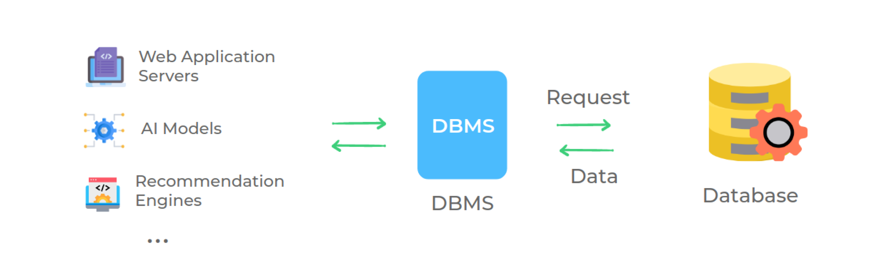
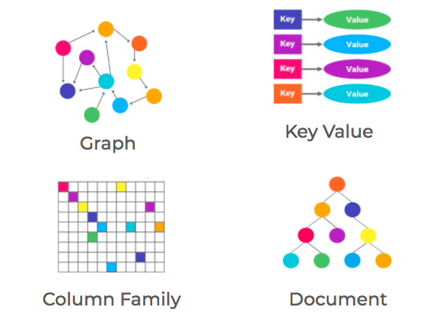
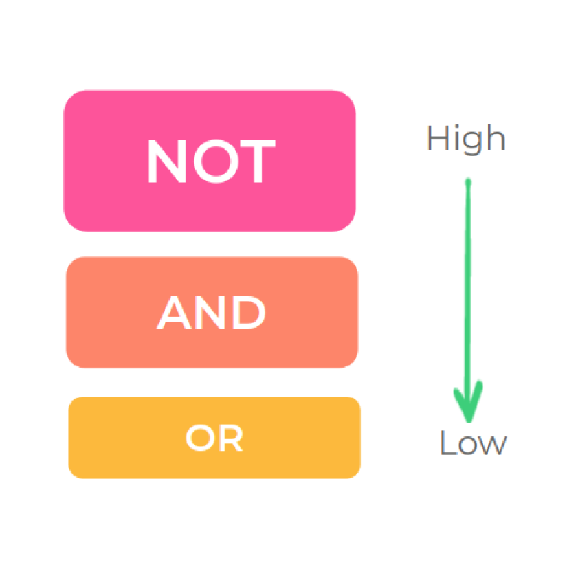
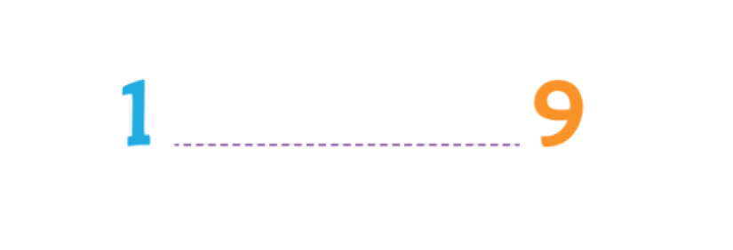
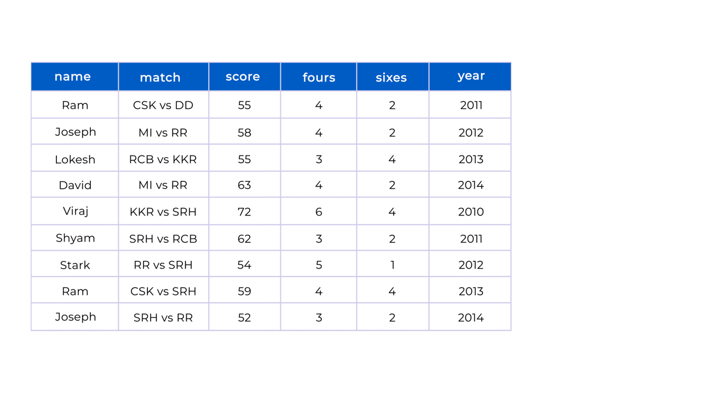

# SQLite

<details>
<summary>Index</summary>

### Index
* Database
* Introduction to SQL
* SQL commands
* Operators
* Pagination
* Aggregations
* Alias
* GROUP BY with HAVING
* Expressions
* SQL Functions
* CASE
* SET Operators
* Milestone
* Relational Database
* JOINS
* SubQueries

</details>

---

<details>
<summary>Database</summary>

### Database

##### Data
Any information that is stored is called data.

__Examples__:
* __Messages & Multimedia__ on WhatsApp
* __Products and orders__ on Amazon
* __Contact details__ in telephone directory..etc

##### Database
An organised collection of data is called a database.

##### DBMS
__DBMS__ stands for __Database Management System__  
A software that is used to easily __store__ and __access__ data from the database in a secure way.


##### Types of Databases
1. Relational Database
2. Non-Relational Database

##### Relational Database
__RDBMS__ stands for __Relational DBMS__  
A relational DBMS is a DBMS designed specially for relational database. Relational databases organise the data in the form of tables.

__Examples__ :  
`Oracle`, `MySQL`, `SQLite`


##### Non-Relational Database
A No-relational DBMS is a DBMS designed specially for non-relational databases. Non-relational databases store the data in a non-tabular form.

Example:  
`MongoDB`, `Redis`



</details>

---

<details>
<summary>Introduction to SQL</summary>

### Introduction to SQL

__SQL__ stands for __Structured Query Language__  
* SQL is used to perform operations on Relational DBMS.
* SQL is easy to learn
* SQL provides multiple commands to perform various operations like `create`, `retrive`, `update` and `delete` the data.

</details>

---

<details>
<summary>SQL commands</summary>

### SQL commands

__CRUD__ operations:  

| Operation   | Description                                             |
| ----------- | ------------------------------------------------------- |
| Create      | Creating new records or entries in a database or system |
| Retrieve    | Fetching or reading data from a database or system     |
| Update      | Modifying or editing existing data in a database or system |
| Delete      | Removing or deleting records or data from a database or system |


| Operation | SQL Syntax                                        |
| --------- | ------------------------------------------------- |
| Create    | `INSERT INTO table_name (column1, column2) VALUES (value1, value2);` |
| Retrieve  | `SELECT column1, column2 FROM table_name WHERE condition;` |
| Update    | `UPDATE table_name SET column1 = value1, column2 = value2 WHERE condition;` |
| Delete    | `DELETE FROM table_name WHERE condition;` |


##### Create Table

```SQL 
CREATE TABLE player(
    name VARCHAR(200),
    age INTEGER,
    score INTEGER
);
```

| Data Type | Description           |
| --------- | --------------------- |
| INTEGER / INT | Represents whole numbers without decimal points. |
| FLOAT | Represents approximate numeric values with decimal points. |
| VARCHAR | Variable-length character strings (strings of varying lengths). |
| TEXT | Stores large amounts of textual data. |
| DATE | Represents a date (year, month, and day). |
| TIME | Represents a time of day (hours, minutes, seconds, and fractions of a second). |
| DATETIME | Represents a combination of date and time. |
| BOOLEAN | Represents true or false values. |

##### Table Information

```SQL 
    PRAGMA TABLE_INFO(player);
```

##### Inserting ROWS

```SQL 
INSERT INTO 
     player(name, age, score)
VALUES 
     ("Rakesh", 39, 35),
     ("Sai", 47, 30);
```

##### Retrieving Data

##### Selecting All Columns
```SQL 
SELECT * 
FROM player;
```

##### Select Specific Column

```SQL 
SELECT 
     name, 
     age
FROM 
     player;
```

##### Selecting Specific Rows

`WHERE` clause specifies a condition that has to be satisfied for retrieving the data from a database.

```SQL 
SELECT *
FROM player
WHERE name = "Sai";
```

##### Update Rows

##### Update All Rows

```SQL 
UPDATE 
    player
SET 
    score = 100;
```

##### Update Specific Rows

```SQL
UPDATE 
    player
SET 
   score = 150
WHERE 
   name = "Ram";
```

##### Delete Rows

##### Delete All Rows
```SQL 
DELETE FROM 
    player;
```

##### Delete Specific Rows
```SQL 
DELETE FROM 
    player
WHERE 
    name = "Shyam";
```

##### Drop Table
`DROP` clause is used to delete a table from the database.
```SQL 
DROP TABLE player;
```

##### Alter Table 
`Alter` clause is used to __add__, __delete__, or __modify__ columns in an existing table. Default values for newly added columns in the existing rows will be __NULL__.

```SQL 
ALTER TABLE 
   player
ADD 
   jersey_num INT
```

```SQL 
ALTER TABLE 
    player RENAME COLUMN jersey_num TO jersey_number;
```

</details>

---

<details>
<summary>Operators</summary>

### Operators

##### Comparison Operators
* `__=__`  Equal to
* `__<>__`  Not Equal to
* `__<__`  Less than
* `__>__`  Greater than
* `__<=__`  Less than or Equal to
* `__>=__`  Greater than or Equal to
  
```sql 
  SELECT * 
  FROM player
  WHERE age <> 20;
```

##### String Operations
`LIKE` Operator is used to perform queries on strings. This operator is especially used in `WHERE` clause to retrieve all the rows that match the given pattern.

| Symbol            | Description                        | Example                     |
| ----------------- | ---------------------------------- | ----------------------------|
| Percent sign (%)  | Represents zero or more characters | ch%finds ch, chips, chocolate.. |
| Underscore (_)    | Represents a single character      | _atfinds mat, hat, and bat   |


| Pattern           | Example                  | Description                                      |
| ----------------- | ------------------------ | ------------------------------------------------ |
| Exact Match       | `WHERE name LIKE "mobiles"` | Retrieves products whose name is exactly equal to "mobiles" |
| Starts With       | `WHERE name LIKE "mobiles%"` | Retrieves products whose name starts with "mobiles" |
| Ends With         | `WHERE name LIKE "%mobiles"` | Retrieves products whose name ends with "mobiles" |
| Contains          | `WHERE name LIKE "%mobiles%"` | Retrieves products whose name contains "mobiles" anywhere within it |
| Pattern Matching  | `WHERE name LIKE "a_%"`      | Retrieves products whose name starts with "a" and has at least 2 characters in length |


```SQL 
SELECT
  *
FROM
  product
WHERE
  category LIKE "Gadgets";
```

Get all the products which have exactly 5 characters in brand from the product table.
```SQL 
SELECT
  *
FROM
  product
WHERE
  brand LIKE "_____";
```

##### Logical Operators
with logical operators, we can perform queries based on multiple conditions.
* AND
* OR
* NOT

| Operator | Description                                          |
| -------- | ---------------------------------------------------- |
| AND      | Used to fetch rows that satisfy two or more conditions. |
| OR       | Used to fetch rows that satisfy at least one of the given conditions. |
| NOT      | Used to negate a condition in the WHERE clause.     |

```SQL 
SELECT
  *
FROM
  product
WHERE
  category = "Clothing"
  AND price <= 1000;
```

```SQL 
-- Ignore all the products with name containing "Cake" from the list of products.
SELECT  
  *
FROM
  product
WHERE
  NOT name LIKE "%Cake%";
``` 


```SQL 
SELECT
  *
FROM
  product
WHERE
  brand = "Redmi"
  AND rating > 4
  OR brand = "OnePlus";
```

Above query is equal to below code

```SQL 
SELECT
    *
FROM
    product
WHERE
    (brand = "Redmi"
    AND rating > 4)
    OR brand = "OnePlus";
```

##### IN operator
Retrieves the corresponding rows from the table if the value of column(c1) is present in the given values(v1,v2,..).


```SQL 
SELECT
  *
FROM
  product
WHERE
  brand IN ( "Puma", "Levi's", "Mufti", "Lee", "Denim");
```

##### BETWEEN Operator
Retrieves all the rows from table that have cloumn(c1) value present between the given range(v1 and v2).


```SQL 
SELECT
  name,
  price,
  brand
FROM
  product
WHERE
  price BETWEEN 1000
  AND 5000;
```

Note : When using the BETWEEN operator, the first value should be less than second value. If not, we'll get an incorrect result depending on the DBMS.


##### ORDER BY
Arrange Ascending order or Descending order.
`column1 ASC / DESC,`

```SQL 
SELECT
  name,
  price,
  rating
FROM
  product
WHERE
  brand = "Puma"
ORDER BY
  price ASC,
  rating DESC;
```

##### DISTINCT
`DISTINCT` clause is used to return the distinct i.e unique values.

```SQL 
SELECT
  DISTINCT brand
FROM
  product
ORDER BY
  brand;
```

</details>

---

<details>
<summary>Pagination</summary>

### Pagination
we get limited data only.
* LIMIT 
* OFFSET

##### LIMIT
LIMIT clause is used to specify the number of rows(n) we would like to have in result.

```SQL 
SELECT
  name,
  price,
  rating
FROM
  product
WHERE
  brand = "Puma"
ORDER BY
  rating DESC
LIMIT 2;
```

##### OFFSET
OFFSET clause is used to specify the position (from nth row) from where the chunk of the results are to be selected.

```SQL 
SELECT
  name,
  price,
  rating
FROM
  product
ORDER BY
  rating DESC
LIMIT 5
OFFSET 5;
```

</details>

---

<details>
<summary>Aggregations</summary>

### Aggregations

##### Aggregation Functions
Combining multiple values into a single value is called aggregation.

| Aggregate Function | Description                                      |
| ------------------ | ----------------------------------               |
| COUNT              | Counts the number of values                     |
| SUM                | Adds all the values                              |
| MIN                | Returns the minimum value                        |
| MAX                | Returns the maximum value                        |
| AVG                | Calculates the average of the values            |



```SQL 
SELECT
  SUM(score)
FROM
  player_match_details
WHERE
  name = "Ram";
```

```SQL 
SELECT
  MAX(score),
  MIN(score)
FROM
  player_match_details
WHERE
  year = 2011;
```

```SQL 
 SELECT COUNT(*)    
 FROM player_match_details;
```
</details>

---

<details>
<summary>Alias</summary>

### Alias
Using the keyword `AS`, we can provide alternate temporary names to the columns in the output.

```sql
SELECT
  name AS player_name
FROM
  player_match_details;
```
</details>

---

<details>
<summary>GROUP BY with HAVING</summary>

### GROUP BY with HAVING

##### GROUP BY 
The `GROUP BY` clause in SQL is used to group rows which have same values for the mentioned attributes.

```SQL 
SELECT
  name, SUM(score) as total_score
FROM
  player_match_details
GROUP BY name;
```


```SQL 
SELECT
 name, COUNT(*) AS half_centuries
FROM 
 player_match_details
WHERE score >= 50
GROUP BY name;
```


##### HAVING
`HAVING` clause is used to filter the resultant rows after the application of `GROUP BY` clause.

```SQL 
SELECT
  name,
  count(*) AS half_centuries
FROM
  player_match_details
WHERE
  score >= 50
GROUP BY
  name
HAVING
  half_centuries > 1;
```


</details>

---

<details>
<summary>Expressions</summary>

### Expressions

##### Using Expressions in SELECT Clause

```SQL 
SELECT 
    id, name, (collection_in_cr-budget_in_cr) as profit
FROM
    movie;
```

##### Using Expressions in WHERE Clause

```SQL 
SELECT
   *
FROM
   movie
WHERE
   (collection_in_cr - budget_in_cr) >= 50;
```

##### Using Expressions in UPDATE Clause
```SQL 
UPDATE movie
SET rating = rating/2;
```

##### Expressions in HAVING Clause

```SQL 
SELECT
  genre
FROM
  movie
GROUP BY
  genre
HAVING
  AVG(collection_in_cr - budget_in_cr) >= 100;
```
</details>

---

<details>
<summary>SQL Functions</summary>

### SQL Functions
1. __Date Functions__: Used to work with dates or times
2. __Cast Functions__: Used to change the data type of a value
3. __Arithmetic Functions__: Used to perform calculations on numbers

##### Date Functions
##### strftime()
`strftime()` function is used to extract year, month, day, hour, etc. from a date (or) datetime field based on a specified format as strings.

| Format | Description           | Output Format          | Function                    | Behavior           |
| ------ | --------------------- | ----------------------- | ---------------------------- | ------------------- |
| %Y     | Year                  | 1990, 2021 etc.         | `strftime("%Y", field_name)` | Extract Year        |
| %m     | Month                 | 01 - 12                | `strftime("%m", field_name)` | Extract Month       |
| %d     | Day of the month      | 01 - 31                | `strftime("%d", field_name)` | Extract Day         |
| %H     | Hour                  | 00 - 24                | `strftime("%H", field_name)` | Extract Hour        |

```SQL 
SELECT 
    strftime('%m', release_date) as month,
    COUNT(*) as total_movies
FROM
    movie
WHERE
    strftime('%Y', release_date) = '2010'
GROUP BY
    strftime('%m', release_date);
```

##### CAST Function
In database management systems, the CAST function is used to convert a value from one data type to another data type.   
`CAST(value AS data_type);`

```SQL 
SELECT
  strftime('%m', release_date) AS MONTH,
  COUNT(*) AS total_movies
FROM
  movie
WHERE
  CAST(strftime('%Y', release_date) AS INTEGER) = 2010
GROUP BY
  strftime('%m', release_date);
```

##### Arithmetic Functions
Arithmetic functions in SQL are used to perform mathematical operations on numeric values. Some commonly used arithmetic functions are `FLOOR`, `CEIL`, and `ROUND`.

* __FLOOR__ Function :  
  The FLOOR function rounds a number to the nearest integer below its current value.
* __CEIL__ Function :  
  The CEIL function rounds a number to the nearest integer above its current value.
* __ROUND__ Function :  
  The ROUND function rounds a number to a specified number of decimal places.


| Function | 2.3 | 3.9 | 4.0 | 5.5 |
|------|-----|-----|-----|-----|
| FLOOR| 2   | 3   | 4   | 5   |
| CEIL | 3   | 4   | 4   | 6   |
| ROUND| 2   | 4   | 4   | 6   |

```SQL 
SELECT
  name,
  ROUND(collection_in_cr, 1) AS RoundedValue,
  CEIL(collection_in_cr) AS CeilValue,
  FLOOR(collection_in_cr) AS FloorValue
FROM
  movie;
```

##### String Functions
String functions in SQL are used to manipulate and operate on string values or character data.
 
| SQL Function | Behavior                               |
| ------------ | -------------------------------------- |
| UPPER()      | Converts a string to upper case       |
| LOWER()      | Converts a string to lowercase         |

```SQL 
SELECT
  name
FROM
  movie
WHERE
  UPPER(name) LIKE UPPER("%avengers%");
```

</details>

---

<details>
<summary>CASE</summary>

### CASE Clause
SQL provides __CASE__ clause to perform conditional operations. This is similar to the switch case / if-else conditions in other programming languages.

```SQL 
SELECT id, name,
  CASE
    WHEN collection_in_cr - budget_in_cr <= 100 THEN collection_in_cr - budget_in_cr * 0.1
    WHEN (collection_in_cr - budget_in_cr > 100
    AND collection_in_cr - budget_in_cr < 500) THEN collection_in_cr - budget_in_cr * 0.15
    ELSE collection_in_cr - budget_in_cr * 0.18
  END AS tax_amount
FROM
  movie;
```
</details>

---

<details>
<summary>SET Operators</summary>

### SET Operators
The SQL Set operation is used to combine the two or more SQL queries.
1. INTERSECT
2. MINUS
3. UNION
4. UNION ALL

```SQL 
SELECT actor_id
FROM cast
WHERE movie_id=6

INTERSECT

SELECT actor_id
FROM cast
WHERE movie_id=15;
```

```SQL 
SELECT actor_id
FROM cast
WHERE movie_id=6

EXCEPT

SELECT actor_id
FROM cast
WHERE movie_id=15;
```

```SQL 
SELECT actor_id
FROM cast
WHERE movie_id=6

UNION

SELECT actor_id
FROM cast
WHERE movie_id=15
ORDER BY 1 DESC;
```

</details>

---

<details>
<summary>Milestone</summary>

### Clauses

| Clause       | How to Use It                             | Functionality                                              |
| ------------ | ---------------------------------------- | --------------------------------------------------------- |
| CREATE TABLE | CREATE TABLE table_name ...               | Creates a new table                                       |
| INSERT       | INSERT INTO table_name ...                | Used to insert new data into the table                     |
| SELECT       | SELECT col1, col2 ...                     | Retrieves the selected columns                             |
| SELECT       | SELECT * FROM ...                         | Retrieves all the columns from a table                    |
| FROM         | FROM table_name                           | Specifies the table(s) where the data columns are located  |
| WHERE        | WHERE col > 5                            | Retrieves specific rows based on given conditions          |
| UPDATE, SET  | UPDATE table_name SET column1 = value1;  | Updates the value of a column for all rows or specific rows|
| DELETE       | DELETE FROM table_name                    | Deletes all rows from the table                            |
| DROP         | DROP TABLE table_name                     | Deletes the table from the database                        |
| ALTER        | ALTER TABLE table_name ...                | Used to add, delete, or modify columns in a table          |
| ORDER BY     | ORDER BY col1 ASC/DESC ...                | Sorts the table based on specified column(s)               |
| DISTINCT     | SELECT DISTINCT col, ...                  | Retrieves unique values from the specified column(s)       |
| LIMIT        | LIMIT 10                                  | Limits the number of rows in the output to the given value |
| OFFSET       | OFFSET 5                                  | Specifies the position (from nth row) for result retrieval |
| GROUP BY     | GROUP BY col ...                         | Groups rows with the same values in the specified columns |
| HAVING       | HAVING col > 20                          | Filters resultant rows after applying the GROUP BY clause  |
| CASE         | CASE WHEN condition1 THEN value1 ... END | Returns a corresponding value when a condition is met     |


##### Operators

| Operator  | How to Use It                    | Functionality                                                                                      |
| --------- | -------------------------------- | -------------------------------------------------------------------------------------------------- |
| `<>`        | WHERE col `<>` 5                  | Filters rows where the given column is not equal to 5 (Other comparison operators: `=, >, <, >=, <=`) |
| LIKE      | WHERE col LIKE '%Apple%'        | Retrieves rows where the column contains 'apple' within the text                               |
| AND       | WHERE col1 > 5 AND col2 < 3     | Retrieves rows that satisfy all the given conditions                                              |
| OR        | WHERE col1 > 5 OR col2 < 3      | Retrieves rows that satisfy at least one of the given conditions                                   |
| NOT       | WHERE NOT col = 'apple'         | Retrieves rows if the condition(s) are NOT TRUE                                                    |
| IN        | WHERE col IN ('Apple', 'Microsoft') | Retrieves rows if the column value matches any of the given values                       |
| BETWEEN   | WHERE col BETWEEN 3 AND 5      | Retrieves rows where the column value falls within the specified range (inclusive)              |

##### Functions

| Function     | How to Use It                      | Functionality                                                                      |
| ------------ | ---------------------------------- | ---------------------------------------------------------------------------------- |
| COUNT        | SELECT COUNT(col) ...              | Counts the number of values in the given column                                  |
| SUM          | SELECT SUM(col) ...                | Adds all the values in the given column                                           |
| MIN          | SELECT MIN(col) ...                | Retrieves the minimum value in the given column                                  |
| MAX          | SELECT MAX(col) ...                | Retrieves the maximum value in the given column                                  |
| AVG          | SELECT AVG(col) ...                | Calculates the average of the values in the given column                         |
| strftime()   | strftime("%Y", col) ...            | Extracts the year from the column value in string format (similarly for other date components) |
| CAST()       | CAST(col AS datatype) ...          | Converts the value to the specified data type                                    |
| FLOOR()      | FLOOR(col) ...                     | Rounds a number to the nearest integer below its current value                   |
| CEIL()       | CEIL(col) ...                      | Rounds a number to the nearest integer above its current value                   |
| ROUND()      | ROUND(col) ...                     | Rounds a number to a specified number of decimal places                         |
| UPPER()      | UPPER(col) ...                     | Converts a string to uppercase                                                   |
| LOWER()      | LOWER(col) ...                     | Converts a string to lowercase                                                   |

</details>

---

<details>
<summary>Relational Database</summary>

### Relational Database

##### Customer Table
```SQL 
CREATE TABLE customer (
   id INTEGER NOT NULL PRIMARY KEY,
   name VARCHAR(250),
   age INT
);
```

##### Product Table

```SQL 
CREATE TABLE product (
  id INTEGER NOT NULL PRIMARY KEY,
  name VARCHAR(250),
  price INT,
  brand VARCHAR(250),
  category VARCHAR(250)
);
```

##### Address Table

```SQL 
CREATE TABLE address(
  id INTEGER NOT NULL PRIMARY KEY,
  pin_code INTEGER,
  door_no VARCHAR(250),
  city VARCHAR(250),
  customer_id INTEGER,
  FOREIGN KEY (customer_id) REFERENCES customer(id) ON DELETE CASCADE
);
```

##### Cart Table

```SQL 
CREATE TABLE cart(
  id INTEGER NOT NULL PRIMARY KEY,
  customer_id INTEGER NOT NULL UNIQUE,
  total_price INTEGER,
  FOREIGN KEY (customer_id) REFERENCES customer(id) ON DELETE CASCADE
);
```

##### Cart Product Table (Junction Table)
```SQL 
CREATE TABLE cart_product(
  id INTEGER NOT NULL PRIMARY KEY,
  cart_id INTEGER,
  product_id INTEGER,
  quantity INTEGER,
  FOREIGN KEY (cart_id) REFERENCES cart(id) ON DELETE CASCADE,
  FOREIGN KEY (product_id) REFERENCES product(id) ON DELETE CASCADE
);
```
</details>

---

<details>
<summary>JOINS</summary>

### JOINS
JOINS are used to combining the tables. 

##### Natural JOIN
`NATURAL JOIN` combines the tables based on the common columns.


```SQL 
SELECT course.name,
  instructor.full_name
FROM course
  NATURAL JOIN instructor
WHERE instructor.full_name = "Alex";
```

##### INNER JOIN
`INNER JOIN` combines rows from both the tables if they meet a specified condition.


```SQL 
SELECT student.full_name,
   review.content,
   review.created_at
FROM 
   student INNER JOIN review 
       ON student.id = review.student_id
WHERE review.course_id = 15;
```

##### LEFT JOIN
In `LEFT JOIN`, for each row in the left table, matched rows from the right table are combined. If there is no match, NULL values are assigned to the right half of the rows in the temporary table.


```SQL 
SELECT student.full_name
FROM 
    student LEFT JOIN student_course
        ON student.id = student_course.student_id
WHERE student_course.id IS NULL;
```

##### Joins on Multiple Tables
We can also perform join on a combined table.

```SQL 
SELECT T.name AS course_name,
   student.full_name
FROM 
    (course INNER JOIN student_course
         ON course.id = student_course.course_id) AS T
    INNER JOIN student
         ON T.student_id = student.id
WHERE course.instructor_id = 102;
```

##### RIGHT JOIN
`RIGHT JOIN` or `RIGHT OUTER JOIN` is vice versa of LEFT JOIN.
I.e., in RIGHT JOIN, for each row in the right table, matched rows from the left table are combined. If there is no match, NULL values are assigned to the left half of the rows in the temporary table.


```SQL 
SELECT course.name,
    instructor.full_name
FROM 
    course RIGHT JOIN instructor
        ON course.instructor_id = instructor.instructor_id;
```

##### FULL JOIN
`FULL JOIN` or `FULL OUTER JOIN` is the result of both RIGHT JOIN and LEFT JOIN


```SQL 
SELECT course.name,
    instructor.full_name
FROM 
    course FULL JOIN instructor
       ON course.instructor_id = instructor.instructor_id;
```

##### CROSS JOIN
In `CROSS JOIN`, each row from the first table is combined with all rows in the second table. 
Cross Join is also called as CARTESIAN JOIN


```SQL 
SELECT 
    course.name AS course_name,
    instructor.full_name AS instructor_name
FROM 
    course CROSS JOIN instructor;
```

##### SELF JOIN
So far, we have learnt to combine different tables. We can also combine a table with itself. This kind of join is called SELF-JOIN.

```SQL 
SELECT sc1.student_id AS student_id1,
  sc2.student_id AS student_id2, sc1.course_id
FROM
   student_course AS sc1
   INNER JOIN student_course AS sc2 ON sc1.course_id = sc2.course_id
WHERE
    sc1.student_id < sc2.student_id;
```

##### Summary
| Join Type     | Use Case                                               |
| ------------- | ------------------------------------------------------ |
| Natural Join  | Joins based on common columns                          |
| Inner Join    | Joins based on a given condition                       |
| Left Join     | Retrieves all rows from the left table and matched rows from the right table |
| Right Join    | Retrieves all rows from the right table and matched rows from the left table |
| Full Join     | Retrieves all rows from both tables                    |
| Cross Join    | Generates all possible combinations of rows from both tables |

</details>

---

<details>
<summary>SubQueries</summary>

### SubQueries
We can write nested queries, i.e., a query inside another query.

```SQL 
SELECT
   name,
   (
       SELECT AVG(rating)
       FROM product
       WHERE category = "WATCH"
   ) - rating AS rating_variance
FROM product
WHERE category = "WATCH";
```

```SQL 
SELECT
  order_id
FROM
  order_details
WHERE
  order_id IN (
    SELECT
      order_id
    FROM
      order_product
    WHERE
      product_id IN (291, 292, 293, 294, 296)
  )
  AND NOT order_id IN (
    SELECT
      order_id
    FROM
      order_product
    WHERE
      product_id IN (227, 228, 229, 232, 233)
  );
```

</details>

---